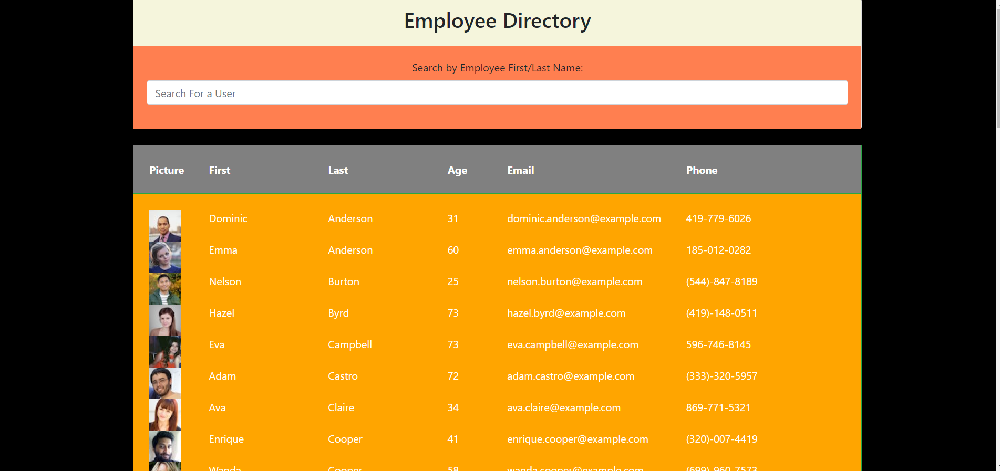
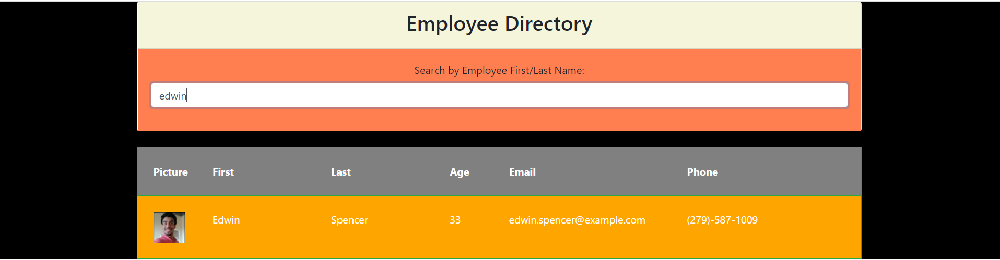
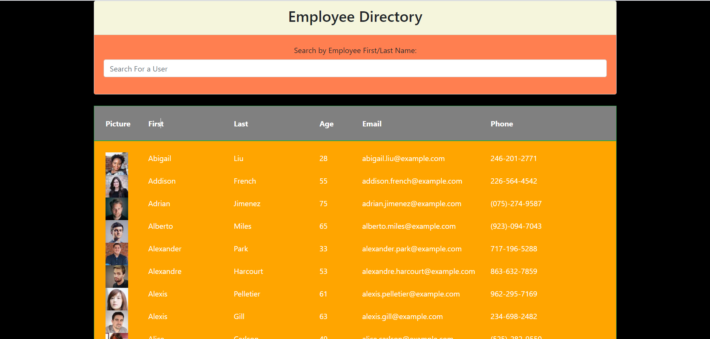

# Employee Directory

[](https://opensource.org/licenses/MIT)

## Description

The scope of thid project wad to create an employee directory with React. The application's UI is broken down into components,the state of each component is managed to respond to the user events.

## Table of Contents

* [Technologies](#technologies)
* [Installation](#installation)
* [Usage](#usage)
* [Deployment](#deployment)
* [Credits](#credits)
* [License](#license)
* [Questions](#questions)

## Technologies

- HTML
- CSS
- JavaScript
- React
- Axios
- React-dom

## Installation

Install all the dependencies available in pacakage.json file using `npm install` command.

The dependencies are below:

[react](https://www.npmjs.com/package/react)

[react-dom](https://www.npmjs.com/package/react-dom)

[axios](https://www.npmjs.com/package/axios)

[react-scripts](https://www.npmjs.com/package/react-scripts)

## Usage

* Application allows user to view their entire employee directory at once with the details like picture,firstname,lastname,age,email and phone number



* Application also allows user/manager to filter employees by name.



* User can also sort the table by categories like first name,last name, age,email and phone



# Deployment

Application is deployed to Github Pages

 Here is a link to the deployed application [Employee Directory](https://anjali9293.github.io/Employee-Directory/) 

## Credits

**[Anjali Pant](https://github.com/Anjali9293)**

## License 

```
Copyright 2020 <Anjali Pant>

Permission is hereby granted, free of charge, to any person obtaining a copy of this software and associated documentation files (the "Software"), to deal in the Software without restriction, including without limitation the rights to use, copy, modify, merge, publish, distribute, sublicense, and/or sell copies of the Software, and to permit persons to whom the Software is furnished to do so, subject to the following conditions:

The above copyright notice and this permission notice shall be included in all copies or substantial portions of the Software.

THE SOFTWARE IS PROVIDED "AS IS", WITHOUT WARRANTY OF ANY KIND, EXPRESS OR IMPLIED, INCLUDING BUT NOT LIMITED TO THE WARRANTIES OF MERCHANTABILITY, FITNESS FOR A PARTICULAR PURPOSE AND NONINFRINGEMENT. IN NO EVENT SHALL THE AUTHORS OR COPYRIGHT HOLDERS BE LIABLE FOR ANY CLAIM, DAMAGES OR OTHER LIABILITY, WHETHER IN AN ACTION OF CONTRACT, TORT OR OTHERWISE, ARISING FROM, OUT OF OR IN CONNECTION WITH THE SOFTWARE OR THE USE OR OTHER DEALINGS IN THE SOFTWARE.
```

## Questions

For more questions about this project, click the link below to view my Github repo:

- [GitHub Profile](https://github.com/Anjali9293)

You can also reach me directly at: pantanjali7@gmail.com
